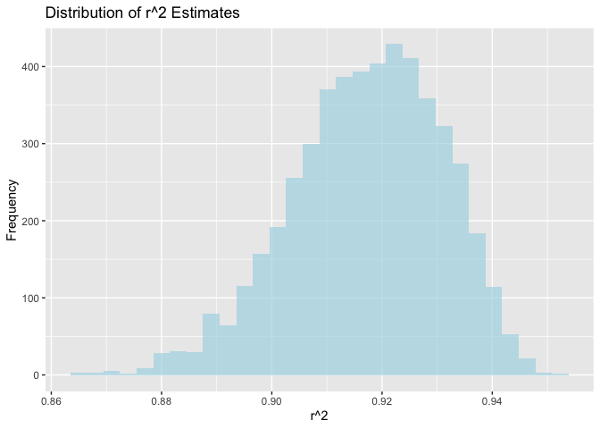
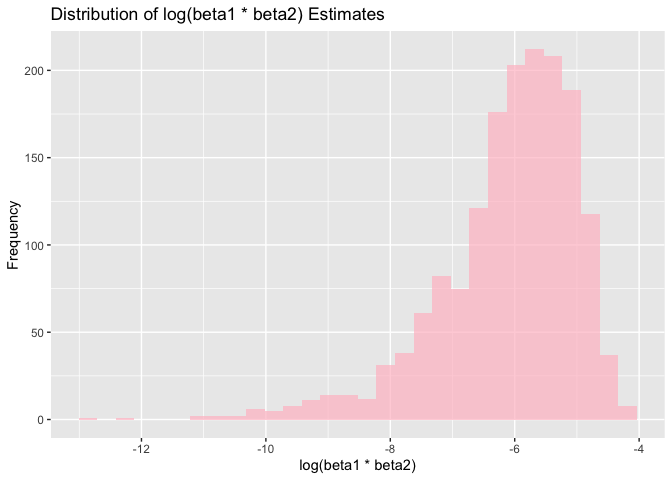

p8105_hw6_sw3737
================
Shiqi Wu
2023-11-30

# Problem 2

## Download the data

``` r
weather_df = 
  rnoaa::meteo_pull_monitors(
    c("USW00094728"),
    var = c("PRCP", "TMIN", "TMAX"), 
    date_min = "2022-01-01",
    date_max = "2022-12-31"
  ) |>
  mutate(
    name = recode(id, USW00094728 = "CentralPark_NY"),
    tmin = tmin / 10,
    tmax = tmax / 10
  ) |>
  select(name, id, everything())
```

    ## using cached file: /Users/olivia/Library/Caches/org.R-project.R/R/rnoaa/noaa_ghcnd/USW00094728.dly

    ## date created (size, mb): 2023-11-30 10:45:01.048399 (8.544)

    ## file min/max dates: 1869-01-01 / 2023-11-30

## Define the bootstrap function

``` r
bootstrap_fn = function(data) {
  sample_df = data |> sample_n(nrow(data), replace = TRUE)
  model = lm(tmax ~ tmin + prcp, data = sample_df)
  tidy_model = broom::tidy(model)
  glance_model = broom::glance(model)
  
  beta1_beta2 = tidy_model$estimate[2] * tidy_model$estimate[3]
  if (beta1_beta2 > 0) {
    log_beta1_beta2 = log(beta1_beta2)
  } else {
    log_beta1_beta2 = NA
  }
  r_squared = glance_model$r.squared
  
  return(c(r_squared, log_beta1_beta2))
}
```

## Perform bootstrap

``` r
set.seed(123)
bootstrap_results = replicate(5000, bootstrap_fn(weather_df))

bootstrap_df = as.data.frame(t(bootstrap_results))
names(bootstrap_df) = c("r_squared", "log_beta1_beta2")
```

## Plot the distributions

``` r
ggplot(bootstrap_df, aes(x = r_squared)) +
  geom_histogram(bins = 30, fill = "lightblue", alpha = 0.7) +
  labs(title = "Distribution of r^2 Estimates", x = "r^2", y = "Frequency")
```

<!-- -->

``` r
ggplot(bootstrap_df, aes(x = log_beta1_beta2)) +
  geom_histogram(bins = 30, fill = "pink", alpha = 0.7) +
  labs(title = "Distribution of log(beta1 * beta2) Estimates", x = "log(beta1 * beta2)", y = "Frequency")
```

    ## Warning: Removed 3363 rows containing non-finite values (`stat_bin()`).

<!-- -->

The first histogram shows a slightly right-skewed distribution of r^2
estimates, clustering around values between 0.90 and 0.94, with a peak
around 0.92. It indicates a common range of variance explained by the
model in the bootstrap samples.

The second histogram a right-skewed distribution of the logarithm of the
beta coefficient, clustering around values between -8 and -4, with a
peak around -6. The distribution has a left tail, indicating that some
bootstrap samples resulted in lower estimates for the product of the
coefficients.

## Calculate and print the 95% confidence intervals

``` r
r_squared_ci = quantile(bootstrap_df$r_squared, c(0.025, 0.975), na.rm = TRUE)
log_beta1_beta2_ci = quantile(bootstrap_df$log_beta1_beta2, c(0.025, 0.975), na.rm = TRUE)

print(paste("95% CI for r^2: Lower Bound = ", r_squared_ci[1], ", Upper Bound = ", r_squared_ci[2]))
```

    ## [1] "95% CI for r^2: Lower Bound =  0.888207887270769 , Upper Bound =  0.94025517661439"

``` r
print(paste("95% CI for log(beta1 * beta2): Lower Bound = ", log_beta1_beta2_ci[1], ", Upper Bound = ", log_beta1_beta2_ci[2]))
```

    ## [1] "95% CI for log(beta1 * beta2): Lower Bound =  -9.0632139063287 , Upper Bound =  -4.61926736850544"
