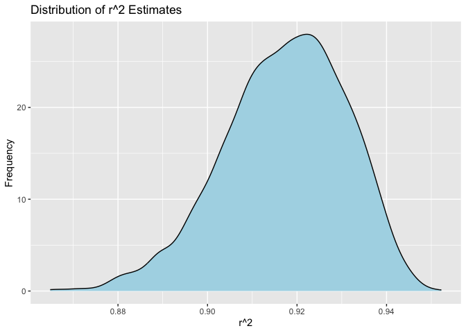
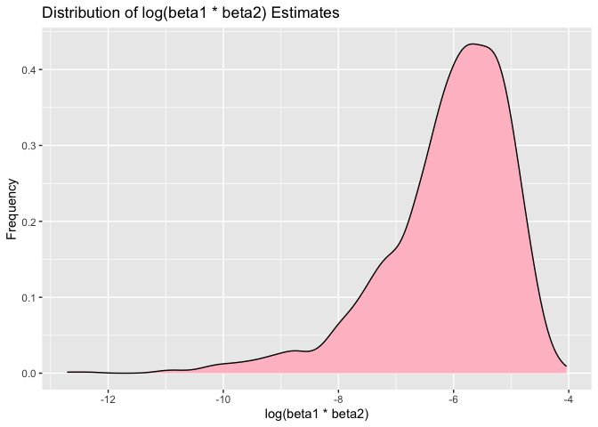

p8105_hw6_sw3737
================
Shiqi Wu
2023-11-30

# Problem 2

## Download the data

``` r
weather_df = 
  rnoaa::meteo_pull_monitors(
    c("USW00094728"),
    var = c("PRCP", "TMIN", "TMAX"), 
    date_min = "2022-01-01",
    date_max = "2022-12-31"
  ) |>
  mutate(
    name = recode(id, USW00094728 = "CentralPark_NY"),
    tmin = tmin / 10,
    tmax = tmax / 10
  ) |>
  select(name, id, everything())
```

    ## using cached file: /Users/olivia/Library/Caches/org.R-project.R/R/rnoaa/noaa_ghcnd/USW00094728.dly

    ## date created (size, mb): 2023-11-30 10:45:01.048399 (8.544)

    ## file min/max dates: 1869-01-01 / 2023-11-30

## Define the bootstrap function

``` r
bootstrap_fn = function(data) {
  sample_df = data |> sample_n(nrow(data), replace = TRUE)
  model = lm(tmax ~ tmin + prcp, data = sample_df)
  tidy_model = broom::tidy(model)
  glance_model = broom::glance(model)
  
  beta1_beta2 = tidy_model$estimate[2] * tidy_model$estimate[3]
  if (beta1_beta2 > 0) {
    log_beta1_beta2 = log(beta1_beta2)
  } else {
    log_beta1_beta2 = NA
  }
  r_squared = glance_model$r.squared
  
  return(c(r_squared, log_beta1_beta2))
}
```

## Perform bootstrap

``` r
set.seed(123)
bootstrap_results = replicate(5000, bootstrap_fn(weather_df))

bootstrap_df = as.data.frame(t(bootstrap_results))
names(bootstrap_df) = c("r_squared", "log_beta1_beta2")
```

## Plot the distributions

``` r
ggplot(bootstrap_df, aes(x = r_squared)) +
  geom_histogram(bins = 30, fill = "lightblue", alpha = 0.7) +
  labs(title = "Distribution of r^2 Estimates", x = "r^2", y = "Frequency")
```

<!-- -->

``` r
ggplot(bootstrap_df, aes(x = log_beta1_beta2)) +
  geom_histogram(bins = 30, fill = "pink", alpha = 0.7) +
  labs(title = "Distribution of log(beta1 * beta2) Estimates", x = "log(beta1 * beta2)", y = "Frequency")
```

    ## Warning: Removed 3363 rows containing non-finite values (`stat_bin()`).

<!-- -->

The first histogram shows a slightly right-skewed distribution of r^2
estimates, clustering around values between 0.90 and 0.94, with a peak
around 0.92. It indicates a common range of variance explained by the
model in the bootstrap samples.

The second histogram a right-skewed distribution of the logarithm of the
beta coefficient, clustering around values between -8 and -4, with a
peak around -6. The distribution has a left tail, indicating that some
bootstrap samples resulted in lower estimates for the product of the
coefficients.

## Calculate and print the 95% confidence intervals

``` r
r_squared_ci = quantile(bootstrap_df$r_squared, c(0.025, 0.975), na.rm = TRUE)
log_beta1_beta2_ci = quantile(bootstrap_df$log_beta1_beta2, c(0.025, 0.975), na.rm = TRUE)

print(paste("95% CI for r^2: Lower Bound = ", r_squared_ci[1], ", Upper Bound = ", r_squared_ci[2]))
```

    ## [1] "95% CI for r^2: Lower Bound =  0.888207887270769 , Upper Bound =  0.94025517661439"

``` r
print(paste("95% CI for log(beta1 * beta2): Lower Bound = ", log_beta1_beta2_ci[1], ", Upper Bound = ", log_beta1_beta2_ci[2]))
```

    ## [1] "95% CI for log(beta1 * beta2): Lower Bound =  -9.0632139063287 , Upper Bound =  -4.61926736850544"

# problem 3

## Load and Clean the Data

``` r
birthweight = read.csv("data/birthweight.csv")
birthweight_df = 
  birthweight |>
  janitor::clean_names() |>
  mutate(
    babysex = as.factor(babysex),
    frace = as.factor(frace),
    malform = as.factor(malform),
    mrace = as.factor(mrace),
  ) |>
  drop_na()
```

## Regression Model

``` r
model = lm(bwt ~ blength + gaweeks + ppbmi + smoken + wtgain + babysex + bhead + frace, data = birthweight_df)

broom::tidy(model)
```

    ## # A tibble: 12 × 5
    ##    term        estimate std.error statistic   p.value
    ##    <chr>          <dbl>     <dbl>     <dbl>     <dbl>
    ##  1 (Intercept) -5759.     101.      -56.9   0        
    ##  2 blength        76.6      2.02     37.9   2.17e-271
    ##  3 gaweeks        11.3      1.47      7.67  2.13e- 14
    ##  4 ppbmi           7.33     1.34      5.47  4.67e-  8
    ##  5 smoken         -4.55     0.590    -7.72  1.47e- 14
    ##  6 wtgain          4.12     0.395    10.4   3.57e- 25
    ##  7 babysex2       31.5      8.52      3.69  2.25e-  4
    ##  8 bhead         132.       3.47     38.1   1.26e-273
    ##  9 frace2       -144.       9.32    -15.5   1.14e- 52
    ## 10 frace3        -70.9     41.2      -1.72  8.51e-  2
    ## 11 frace4       -138.      18.6      -7.42  1.40e- 13
    ## 12 frace8        -56.0     73.7      -0.760 4.48e-  1

``` r
broom::glance(model)
```

    ## # A tibble: 1 × 12
    ##   r.squared adj.r.squared sigma statistic p.value    df  logLik    AIC    BIC
    ##       <dbl>         <dbl> <dbl>     <dbl>   <dbl> <dbl>   <dbl>  <dbl>  <dbl>
    ## 1     0.713         0.712  275.      977.       0    11 -30539. 61105. 61188.
    ## # ℹ 3 more variables: deviance <dbl>, df.residual <int>, nobs <int>

``` r
summary(model)
```

    ## 
    ## Call:
    ## lm(formula = bwt ~ blength + gaweeks + ppbmi + smoken + wtgain + 
    ##     babysex + bhead + frace, data = birthweight_df)
    ## 
    ## Residuals:
    ##      Min       1Q   Median       3Q      Max 
    ## -1077.78  -187.17    -3.28   177.53  2400.30 
    ## 
    ## Coefficients:
    ##               Estimate Std. Error t value Pr(>|t|)    
    ## (Intercept) -5758.8517   101.2690 -56.867  < 2e-16 ***
    ## blength        76.5873     2.0221  37.874  < 2e-16 ***
    ## gaweeks        11.2694     1.4695   7.669 2.13e-14 ***
    ## ppbmi           7.3281     1.3389   5.473 4.67e-08 ***
    ## smoken         -4.5505     0.5897  -7.717 1.47e-14 ***
    ## wtgain          4.1234     0.3953  10.430  < 2e-16 ***
    ## babysex2       31.4559     8.5182   3.693 0.000225 ***
    ## bhead         132.1067     3.4714  38.055  < 2e-16 ***
    ## frace2       -144.3780     9.3249 -15.483  < 2e-16 ***
    ## frace3        -70.8798    41.1504  -1.722 0.085058 .  
    ## frace4       -138.3724    18.6484  -7.420 1.40e-13 ***
    ## frace8        -55.9818    73.6997  -0.760 0.447539    
    ## ---
    ## Signif. codes:  0 '***' 0.001 '**' 0.01 '*' 0.05 '.' 0.1 ' ' 1
    ## 
    ## Residual standard error: 274.8 on 4330 degrees of freedom
    ## Multiple R-squared:  0.7129, Adjusted R-squared:  0.7122 
    ## F-statistic: 977.4 on 11 and 4330 DF,  p-value: < 2.2e-16

### Modeling Process

1)  Initial model: I used a linear regression to build a model
    predicting baby’s birth weight, the choice of predictors was based
    on my understanding of what factors might influence birth weight. It
    included `length`, `gaweeks`, `malform`, `ppbmi`, `smoken` and
    `wtgain`.
2)  Adjust model (data-driven approach): Upon observing that the current
    r^2 is relatively low, I was opting to adjust the model by removing
    `malform` (as its p-value exceeds 0.05), introducing `babysex`,
    `bhead` and `frace` (which increase r^2) as additional predictors.
    Now it has a stronger correlation with birth weight.

## Residual Analysis

``` r
birthweight_df = birthweight_df |>
  add_predictions(model) |>
  add_residuals(model)

ggplot(birthweight_df, aes(x = pred, y = resid)) +
  geom_point(alpha = 0.5) +
  labs(x = "Fitted values", y = "Residuals") +
  geom_hline(yintercept = 0, linetype = "dashed", color = "red")
```

<!-- -->

### Interpretation of Plot

The majority of the data points are clustered around the horizontal line
at zero. However, there is a pattern where the residuals appear to fan
out as the fitted values increase, suggesting potential
heteroscedasticity. A few outliers are also evident, particularly for
larger residuals.

## Compare Models Using Cross-Validated Prediction Error

``` r
model_1 = lm(bwt ~ blength + gaweeks, data = birthweight_df)
model_2 = lm(bwt ~ bhead * blength * babysex, data = birthweight_df)

cv_df = 
  crossv_mc(birthweight_df, 100)
cv_df = cv_df |>
  mutate(
    train = map(train, as_tibble),
    test = map(test, as_tibble)
  ) |>
  mutate(
    model = map (train, \(df) lm(bwt ~ blength + gaweeks + ppbmi + smoken + wtgain + babysex + bhead + frace, data = df)),
    model_1 = map (train, \(df) lm(bwt ~ blength + gaweeks, data = df)),
    model_2 = map (train, \(df) lm(bwt ~ bhead * blength * babysex, data = df))
  ) |>
  mutate(
    rmse_model = map2_dbl(model, test, \(model, df) rmse(model,df)),
    rmse_model_1 = map2_dbl(model_1, test, \(model, df) rmse(model,df)),
    rmse_model_2 = map2_dbl(model_2, test, \(model, df) rmse(model,df))
  )

summary(cv_df)
```

    ##  train.Length  train.Class  train.Mode test.Length  test.Class  test.Mode
    ##  22      tbl_df  list                  22      tbl_df  list              
    ##  22      tbl_df  list                  22      tbl_df  list              
    ##  22      tbl_df  list                  22      tbl_df  list              
    ##  22      tbl_df  list                  22      tbl_df  list              
    ##  22      tbl_df  list                  22      tbl_df  list              
    ##  22      tbl_df  list                  22      tbl_df  list              
    ##  22      tbl_df  list                  22      tbl_df  list              
    ##  22      tbl_df  list                  22      tbl_df  list              
    ##  22      tbl_df  list                  22      tbl_df  list              
    ##  22      tbl_df  list                  22      tbl_df  list              
    ##  22      tbl_df  list                  22      tbl_df  list              
    ##  22      tbl_df  list                  22      tbl_df  list              
    ##  22      tbl_df  list                  22      tbl_df  list              
    ##  22      tbl_df  list                  22      tbl_df  list              
    ##  22      tbl_df  list                  22      tbl_df  list              
    ##  22      tbl_df  list                  22      tbl_df  list              
    ##  22      tbl_df  list                  22      tbl_df  list              
    ##  22      tbl_df  list                  22      tbl_df  list              
    ##  22      tbl_df  list                  22      tbl_df  list              
    ##  22      tbl_df  list                  22      tbl_df  list              
    ##  22      tbl_df  list                  22      tbl_df  list              
    ##  22      tbl_df  list                  22      tbl_df  list              
    ##  22      tbl_df  list                  22      tbl_df  list              
    ##  22      tbl_df  list                  22      tbl_df  list              
    ##  22      tbl_df  list                  22      tbl_df  list              
    ##  22      tbl_df  list                  22      tbl_df  list              
    ##  22      tbl_df  list                  22      tbl_df  list              
    ##  22      tbl_df  list                  22      tbl_df  list              
    ##  22      tbl_df  list                  22      tbl_df  list              
    ##  22      tbl_df  list                  22      tbl_df  list              
    ##  22      tbl_df  list                  22      tbl_df  list              
    ##  22      tbl_df  list                  22      tbl_df  list              
    ##  22      tbl_df  list                  22      tbl_df  list              
    ##  22      tbl_df  list                  22      tbl_df  list              
    ##  22      tbl_df  list                  22      tbl_df  list              
    ##  22      tbl_df  list                  22      tbl_df  list              
    ##  22      tbl_df  list                  22      tbl_df  list              
    ##  22      tbl_df  list                  22      tbl_df  list              
    ##  22      tbl_df  list                  22      tbl_df  list              
    ##  22      tbl_df  list                  22      tbl_df  list              
    ##  22      tbl_df  list                  22      tbl_df  list              
    ##  22      tbl_df  list                  22      tbl_df  list              
    ##  22      tbl_df  list                  22      tbl_df  list              
    ##  22      tbl_df  list                  22      tbl_df  list              
    ##  22      tbl_df  list                  22      tbl_df  list              
    ##  22      tbl_df  list                  22      tbl_df  list              
    ##  22      tbl_df  list                  22      tbl_df  list              
    ##  22      tbl_df  list                  22      tbl_df  list              
    ##  22      tbl_df  list                  22      tbl_df  list              
    ##  22      tbl_df  list                  22      tbl_df  list              
    ##  22      tbl_df  list                  22      tbl_df  list              
    ##  22      tbl_df  list                  22      tbl_df  list              
    ##  22      tbl_df  list                  22      tbl_df  list              
    ##  22      tbl_df  list                  22      tbl_df  list              
    ##  22      tbl_df  list                  22      tbl_df  list              
    ##  22      tbl_df  list                  22      tbl_df  list              
    ##  22      tbl_df  list                  22      tbl_df  list              
    ##  22      tbl_df  list                  22      tbl_df  list              
    ##  22      tbl_df  list                  22      tbl_df  list              
    ##  22      tbl_df  list                  22      tbl_df  list              
    ##  22      tbl_df  list                  22      tbl_df  list              
    ##  22      tbl_df  list                  22      tbl_df  list              
    ##  22      tbl_df  list                  22      tbl_df  list              
    ##  22      tbl_df  list                  22      tbl_df  list              
    ##  22      tbl_df  list                  22      tbl_df  list              
    ##  22      tbl_df  list                  22      tbl_df  list              
    ##  22      tbl_df  list                  22      tbl_df  list              
    ##  22      tbl_df  list                  22      tbl_df  list              
    ##  22      tbl_df  list                  22      tbl_df  list              
    ##  22      tbl_df  list                  22      tbl_df  list              
    ##  22      tbl_df  list                  22      tbl_df  list              
    ##  22      tbl_df  list                  22      tbl_df  list              
    ##  22      tbl_df  list                  22      tbl_df  list              
    ##  22      tbl_df  list                  22      tbl_df  list              
    ##  22      tbl_df  list                  22      tbl_df  list              
    ##  22      tbl_df  list                  22      tbl_df  list              
    ##  22      tbl_df  list                  22      tbl_df  list              
    ##  22      tbl_df  list                  22      tbl_df  list              
    ##  22      tbl_df  list                  22      tbl_df  list              
    ##  22      tbl_df  list                  22      tbl_df  list              
    ##  22      tbl_df  list                  22      tbl_df  list              
    ##  22      tbl_df  list                  22      tbl_df  list              
    ##  22      tbl_df  list                  22      tbl_df  list              
    ##  22      tbl_df  list                  22      tbl_df  list              
    ##  22      tbl_df  list                  22      tbl_df  list              
    ##  22      tbl_df  list                  22      tbl_df  list              
    ##  22      tbl_df  list                  22      tbl_df  list              
    ##  22      tbl_df  list                  22      tbl_df  list              
    ##  22      tbl_df  list                  22      tbl_df  list              
    ##  22      tbl_df  list                  22      tbl_df  list              
    ##  22      tbl_df  list                  22      tbl_df  list              
    ##  22      tbl_df  list                  22      tbl_df  list              
    ##  22      tbl_df  list                  22      tbl_df  list              
    ##  22      tbl_df  list                  22      tbl_df  list              
    ##  22      tbl_df  list                  22      tbl_df  list              
    ##  22      tbl_df  list                  22      tbl_df  list              
    ##  22      tbl_df  list                  22      tbl_df  list              
    ##  22      tbl_df  list                  22      tbl_df  list              
    ##  22      tbl_df  list                  22      tbl_df  list              
    ##  22      tbl_df  list                  22      tbl_df  list              
    ##      .id            model.Length  model.Class  model.Mode
    ##  Length:100         13    lm    list                     
    ##  Class :character   13    lm    list                     
    ##  Mode  :character   13    lm    list                     
    ##                     13    lm    list                     
    ##                     13    lm    list                     
    ##                     13    lm    list                     
    ##                     13    lm    list                     
    ##                     13    lm    list                     
    ##                     13    lm    list                     
    ##                     13    lm    list                     
    ##                     13    lm    list                     
    ##                     13    lm    list                     
    ##                     13    lm    list                     
    ##                     13    lm    list                     
    ##                     13    lm    list                     
    ##                     13    lm    list                     
    ##                     13    lm    list                     
    ##                     13    lm    list                     
    ##                     13    lm    list                     
    ##                     13    lm    list                     
    ##                     13    lm    list                     
    ##                     13    lm    list                     
    ##                     13    lm    list                     
    ##                     13    lm    list                     
    ##                     13    lm    list                     
    ##                     13    lm    list                     
    ##                     13    lm    list                     
    ##                     13    lm    list                     
    ##                     13    lm    list                     
    ##                     13    lm    list                     
    ##                     13    lm    list                     
    ##                     13    lm    list                     
    ##                     13    lm    list                     
    ##                     13    lm    list                     
    ##                     13    lm    list                     
    ##                     13    lm    list                     
    ##                     13    lm    list                     
    ##                     13    lm    list                     
    ##                     13    lm    list                     
    ##                     13    lm    list                     
    ##                     13    lm    list                     
    ##                     13    lm    list                     
    ##                     13    lm    list                     
    ##                     13    lm    list                     
    ##                     13    lm    list                     
    ##                     13    lm    list                     
    ##                     13    lm    list                     
    ##                     13    lm    list                     
    ##                     13    lm    list                     
    ##                     13    lm    list                     
    ##                     13    lm    list                     
    ##                     13    lm    list                     
    ##                     13    lm    list                     
    ##                     13    lm    list                     
    ##                     13    lm    list                     
    ##                     13    lm    list                     
    ##                     13    lm    list                     
    ##                     13    lm    list                     
    ##                     13    lm    list                     
    ##                     13    lm    list                     
    ##                     13    lm    list                     
    ##                     13    lm    list                     
    ##                     13    lm    list                     
    ##                     13    lm    list                     
    ##                     13    lm    list                     
    ##                     13    lm    list                     
    ##                     13    lm    list                     
    ##                     13    lm    list                     
    ##                     13    lm    list                     
    ##                     13    lm    list                     
    ##                     13    lm    list                     
    ##                     13    lm    list                     
    ##                     13    lm    list                     
    ##                     13    lm    list                     
    ##                     13    lm    list                     
    ##                     13    lm    list                     
    ##                     13    lm    list                     
    ##                     13    lm    list                     
    ##                     13    lm    list                     
    ##                     13    lm    list                     
    ##                     13    lm    list                     
    ##                     13    lm    list                     
    ##                     13    lm    list                     
    ##                     13    lm    list                     
    ##                     13    lm    list                     
    ##                     13    lm    list                     
    ##                     13    lm    list                     
    ##                     13    lm    list                     
    ##                     13    lm    list                     
    ##                     13    lm    list                     
    ##                     13    lm    list                     
    ##                     13    lm    list                     
    ##                     13    lm    list                     
    ##                     13    lm    list                     
    ##                     13    lm    list                     
    ##                     13    lm    list                     
    ##                     13    lm    list                     
    ##                     13    lm    list                     
    ##                     13    lm    list                     
    ##                     13    lm    list                     
    ##  model_1.Length  model_1.Class  model_1.Mode
    ##  12    lm    list                           
    ##  12    lm    list                           
    ##  12    lm    list                           
    ##  12    lm    list                           
    ##  12    lm    list                           
    ##  12    lm    list                           
    ##  12    lm    list                           
    ##  12    lm    list                           
    ##  12    lm    list                           
    ##  12    lm    list                           
    ##  12    lm    list                           
    ##  12    lm    list                           
    ##  12    lm    list                           
    ##  12    lm    list                           
    ##  12    lm    list                           
    ##  12    lm    list                           
    ##  12    lm    list                           
    ##  12    lm    list                           
    ##  12    lm    list                           
    ##  12    lm    list                           
    ##  12    lm    list                           
    ##  12    lm    list                           
    ##  12    lm    list                           
    ##  12    lm    list                           
    ##  12    lm    list                           
    ##  12    lm    list                           
    ##  12    lm    list                           
    ##  12    lm    list                           
    ##  12    lm    list                           
    ##  12    lm    list                           
    ##  12    lm    list                           
    ##  12    lm    list                           
    ##  12    lm    list                           
    ##  12    lm    list                           
    ##  12    lm    list                           
    ##  12    lm    list                           
    ##  12    lm    list                           
    ##  12    lm    list                           
    ##  12    lm    list                           
    ##  12    lm    list                           
    ##  12    lm    list                           
    ##  12    lm    list                           
    ##  12    lm    list                           
    ##  12    lm    list                           
    ##  12    lm    list                           
    ##  12    lm    list                           
    ##  12    lm    list                           
    ##  12    lm    list                           
    ##  12    lm    list                           
    ##  12    lm    list                           
    ##  12    lm    list                           
    ##  12    lm    list                           
    ##  12    lm    list                           
    ##  12    lm    list                           
    ##  12    lm    list                           
    ##  12    lm    list                           
    ##  12    lm    list                           
    ##  12    lm    list                           
    ##  12    lm    list                           
    ##  12    lm    list                           
    ##  12    lm    list                           
    ##  12    lm    list                           
    ##  12    lm    list                           
    ##  12    lm    list                           
    ##  12    lm    list                           
    ##  12    lm    list                           
    ##  12    lm    list                           
    ##  12    lm    list                           
    ##  12    lm    list                           
    ##  12    lm    list                           
    ##  12    lm    list                           
    ##  12    lm    list                           
    ##  12    lm    list                           
    ##  12    lm    list                           
    ##  12    lm    list                           
    ##  12    lm    list                           
    ##  12    lm    list                           
    ##  12    lm    list                           
    ##  12    lm    list                           
    ##  12    lm    list                           
    ##  12    lm    list                           
    ##  12    lm    list                           
    ##  12    lm    list                           
    ##  12    lm    list                           
    ##  12    lm    list                           
    ##  12    lm    list                           
    ##  12    lm    list                           
    ##  12    lm    list                           
    ##  12    lm    list                           
    ##  12    lm    list                           
    ##  12    lm    list                           
    ##  12    lm    list                           
    ##  12    lm    list                           
    ##  12    lm    list                           
    ##  12    lm    list                           
    ##  12    lm    list                           
    ##  12    lm    list                           
    ##  12    lm    list                           
    ##  12    lm    list                           
    ##  12    lm    list                           
    ##  model_2.Length  model_2.Class  model_2.Mode   rmse_model     rmse_model_1  
    ##  13    lm    list                            Min.   :257.7   Min.   :310.5  
    ##  13    lm    list                            1st Qu.:269.5   1st Qu.:323.7  
    ##  13    lm    list                            Median :275.1   Median :330.9  
    ##  13    lm    list                            Mean   :276.1   Mean   :334.1  
    ##  13    lm    list                            3rd Qu.:282.0   3rd Qu.:338.5  
    ##  13    lm    list                            Max.   :301.5   Max.   :375.2  
    ##  13    lm    list                                                           
    ##  13    lm    list                                                           
    ##  13    lm    list                                                           
    ##  13    lm    list                                                           
    ##  13    lm    list                                                           
    ##  13    lm    list                                                           
    ##  13    lm    list                                                           
    ##  13    lm    list                                                           
    ##  13    lm    list                                                           
    ##  13    lm    list                                                           
    ##  13    lm    list                                                           
    ##  13    lm    list                                                           
    ##  13    lm    list                                                           
    ##  13    lm    list                                                           
    ##  13    lm    list                                                           
    ##  13    lm    list                                                           
    ##  13    lm    list                                                           
    ##  13    lm    list                                                           
    ##  13    lm    list                                                           
    ##  13    lm    list                                                           
    ##  13    lm    list                                                           
    ##  13    lm    list                                                           
    ##  13    lm    list                                                           
    ##  13    lm    list                                                           
    ##  13    lm    list                                                           
    ##  13    lm    list                                                           
    ##  13    lm    list                                                           
    ##  13    lm    list                                                           
    ##  13    lm    list                                                           
    ##  13    lm    list                                                           
    ##  13    lm    list                                                           
    ##  13    lm    list                                                           
    ##  13    lm    list                                                           
    ##  13    lm    list                                                           
    ##  13    lm    list                                                           
    ##  13    lm    list                                                           
    ##  13    lm    list                                                           
    ##  13    lm    list                                                           
    ##  13    lm    list                                                           
    ##  13    lm    list                                                           
    ##  13    lm    list                                                           
    ##  13    lm    list                                                           
    ##  13    lm    list                                                           
    ##  13    lm    list                                                           
    ##  13    lm    list                                                           
    ##  13    lm    list                                                           
    ##  13    lm    list                                                           
    ##  13    lm    list                                                           
    ##  13    lm    list                                                           
    ##  13    lm    list                                                           
    ##  13    lm    list                                                           
    ##  13    lm    list                                                           
    ##  13    lm    list                                                           
    ##  13    lm    list                                                           
    ##  13    lm    list                                                           
    ##  13    lm    list                                                           
    ##  13    lm    list                                                           
    ##  13    lm    list                                                           
    ##  13    lm    list                                                           
    ##  13    lm    list                                                           
    ##  13    lm    list                                                           
    ##  13    lm    list                                                           
    ##  13    lm    list                                                           
    ##  13    lm    list                                                           
    ##  13    lm    list                                                           
    ##  13    lm    list                                                           
    ##  13    lm    list                                                           
    ##  13    lm    list                                                           
    ##  13    lm    list                                                           
    ##  13    lm    list                                                           
    ##  13    lm    list                                                           
    ##  13    lm    list                                                           
    ##  13    lm    list                                                           
    ##  13    lm    list                                                           
    ##  13    lm    list                                                           
    ##  13    lm    list                                                           
    ##  13    lm    list                                                           
    ##  13    lm    list                                                           
    ##  13    lm    list                                                           
    ##  13    lm    list                                                           
    ##  13    lm    list                                                           
    ##  13    lm    list                                                           
    ##  13    lm    list                                                           
    ##  13    lm    list                                                           
    ##  13    lm    list                                                           
    ##  13    lm    list                                                           
    ##  13    lm    list                                                           
    ##  13    lm    list                                                           
    ##  13    lm    list                                                           
    ##  13    lm    list                                                           
    ##  13    lm    list                                                           
    ##  13    lm    list                                                           
    ##  13    lm    list                                                           
    ##  13    lm    list                                                           
    ##   rmse_model_2  
    ##  Min.   :269.1  
    ##  1st Qu.:283.6  
    ##  Median :288.8  
    ##  Mean   :290.1  
    ##  3rd Qu.:296.8  
    ##  Max.   :320.3  
    ##                 
    ##                 
    ##                 
    ##                 
    ##                 
    ##                 
    ##                 
    ##                 
    ##                 
    ##                 
    ##                 
    ##                 
    ##                 
    ##                 
    ##                 
    ##                 
    ##                 
    ##                 
    ##                 
    ##                 
    ##                 
    ##                 
    ##                 
    ##                 
    ##                 
    ##                 
    ##                 
    ##                 
    ##                 
    ##                 
    ##                 
    ##                 
    ##                 
    ##                 
    ##                 
    ##                 
    ##                 
    ##                 
    ##                 
    ##                 
    ##                 
    ##                 
    ##                 
    ##                 
    ##                 
    ##                 
    ##                 
    ##                 
    ##                 
    ##                 
    ##                 
    ##                 
    ##                 
    ##                 
    ##                 
    ##                 
    ##                 
    ##                 
    ##                 
    ##                 
    ##                 
    ##                 
    ##                 
    ##                 
    ##                 
    ##                 
    ##                 
    ##                 
    ##                 
    ##                 
    ##                 
    ##                 
    ##                 
    ##                 
    ##                 
    ##                 
    ##                 
    ##                 
    ##                 
    ##                 
    ##                 
    ##                 
    ##                 
    ##                 
    ##                 
    ##                 
    ##                 
    ##                 
    ##                 
    ##                 
    ##                 
    ##                 
    ##                 
    ## 

## Create a Violin Plot

``` r
cv_df_long = cv_df |>
  select(rmse_model, rmse_model_1, rmse_model_2) |>
  pivot_longer(
    cols = everything(),
    names_to = "model",
    values_to = "rmse"
  ) |>
  mutate(model = factor(model, levels = c("rmse_model", "rmse_model_1", "rmse_model_2")))

ggplot(cv_df_long, aes(x = model, y = rmse, fill = model)) +
  geom_violin(trim = FALSE) +
  labs(
    title = "Comparison of RMSE Across Models",
    x = "Model",
    y = "Root Mean Squared Error (RMSE)"
  ) +
  theme_minimal()
```

<!-- -->

My model has the widest distribution, indicating variability in its
prediction errors across the cross-validation folds. The rmse_model_1
(length and gestational age) has the narrowest distribution, suggesting
more consistent predictions. The rmse_model_2 (interaction of head
circumference, length, sex) has a distribution that is more compact than
my model but less so than rmse_model_1. The median RMSE appears to be
lowest for rmse_model_1, indicating it may have the best predictive
accuracy on average, although the plot suggests there is some overlap in
the RMSE distributions of the three models.
